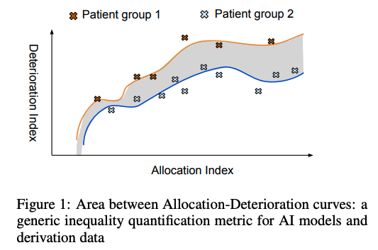

# The Deterioration-Allocation Index (`daindex`): A framework for health inequality evaluation


[](https://www.python.org/downloads/)
[](https://pypi.org/project/daindex/)
[](https://pypi.org/project/daindex/)
[](https://pypi.org/project/daindex/)
[](https://github.com/knowlab/daindex/blob/master/LICENSE)
[](https://github.com/astral-sh/ruff)


[](https://snyk.io/advisor/python/daindex)

This repository implements a **DA-AUC** (deterioration-allocation area under curve) metric for quantifying **inequality** between patient groups (a) embedded in datasets; or (b) induced by statistical / ML / AI models. This is analogous to ROC-AUC for assessing performance of prediction models.

## Methodology

We define and quantify health inequalities in a generic resource allocation scenario using a novel deterioration-allocation framework. The basic idea is to define two indices: a **deterioration** index and an **allocation** index. The allocation index is to be derived from the model of interest.

Conceptually, models used in real-world contexts can be abstracted and thought of as **resource allocators**, predicting for example the probability of Intensive Care Unit (ICU) admission. Note that the models do not need to be particularly designed to allocate resources, for example, risk prediction of cardiovascular disease (CVD) among people with diabetes is also a valid index for downstream resource allocation. Essentially, a resource allocator is a computational model that takes patient data as input and outputs a (normalised) score between 0 and 1. We call this score the allocation index.

The deterioration index is a score between 0 and 1 to measure the deterioration status of patients. It can be derived from an objective measurement for disease prognosis (i.e., *a marker of prognosis* in epidemiology terminology), such as extensively used comorbidity scores or biomarker measurements like those for CVDs.



Once we have defined the two indices, each patient can then be represented as a point in a two-dimensional space of <*allocation index*, *deterioration index*>. A sample of the group of patients is then translated into a set of points in the space, for which a regression model can be fitted to approximate a curve in the space.

The **area** between the two curves is then the deterioration difference between their corresponding patient groups, quantifying the inequalities induced by the `allocator`, i.e., the model that produces the allocation index. The curve with the larger area under it represents the patient group which would be unfairly treated if the allocation index was to be used in allocating resources or services: *a patient from this group would be deemed healthier than a patient from another group who is equally ill*.

See the paper for more details: [Quantifying Health Inequalities Induced by Data and AI Models](https://doi.org/10.24963/ijcai.2022/721).


## Installation of the `daindex` python package

```bash
pip install daindex
```

### Advanced install (for developers)

After cloning the repository, you can install the package in a development `venv` using [`poetry`](https://python-poetry.org/docs/):

```bash
poetry install --with dev
pre-commit install
```

## Usage

1. Create sample data for testing
   ```python
   import pandas as pd
   import numpy as np
   n_size = 100

   # generate female data
   female_mm = [int(m) for m in np.random.normal(3.2, .5, size=n_size)]
   df_female = pd.DataFrame(dict(mm=female_mm, gender=['f'] * n_size))
   df_female.head()

   # generate male data
   male_mm = [int(m) for m in np.random.normal(3, .5, size=n_size)]
   df_male = pd.DataFrame(dict(mm=male_mm, gender=['m'] * n_size))
   df_male.head()

   # merge dataframes
   df = pd.concat([df_female, df_male], ignore_index=True)
   ```
2. Import the `compare_two_groups` function:
    ```python
    from daindex.util import compare_two_groups
    ```

3. Run inequality analysis between the female and male groups:
   ```python
   compare_two_groups(
      df[df.gender=='f'], df[df.gender=='m'], 'mm',
      'female', 'male', '#Multimorbidity', 3, is_discrete=True
   )
   ```

   You will see something similar to.
   ```python
   ({'overall-prob': 0.9999, 'one-step': 0.7199, 'k-step': 0.054609, '|X|': 100},
   {'overall-prob': 0.9999, 'one-step': 0.42, 'k-step': 0.03195, '|X|': 100},
   0.7092018779342724)
   ```
   The result means the inequality of female vs male is `0.709`.

## Tutorials

- We provide a basic use case for the deterioration-allocation index: [basic_tutorial.ipynb](./tutorials/basic_tutorial.ipynb).
- More tutorials will be added, including those for replicating studies on HiRID and MIMIC datasets.

## Contact

[honghan.wu@ucl.ac.uk](mailto:honghan.wu@ucl.ac.uk) or [h.wilde@ucl.ac.uk](mailto:h.wilde@ucl.ac.uk)

## Reference

If using this package in your own work, please cite:

> Honghan Wu, Aneeta Sylolypavan, Minhong Wang, and Sarah Wild. 2022. ‘Quantifying Health Inequalities Induced by Data and AI Models’. In IJCAI-ECAI, 6:5192–98. https://doi.org/10.24963/ijcai.2022/721.

Useful links: [slides](https://www.ucl.ac.uk/research-it-services/sites/research_it_services/files/quantifying_health_inequalities_induced_by_data_and_ai_models_0.pdf), [recording](https://web.microsoftstream.com/video/568b2e88-5c21-466e-9bbf-63274048161d), [arxiv](https://arxiv.org/abs/2205.01066), [proceedings](https://www.ijcai.org/proceedings/2022/721).
